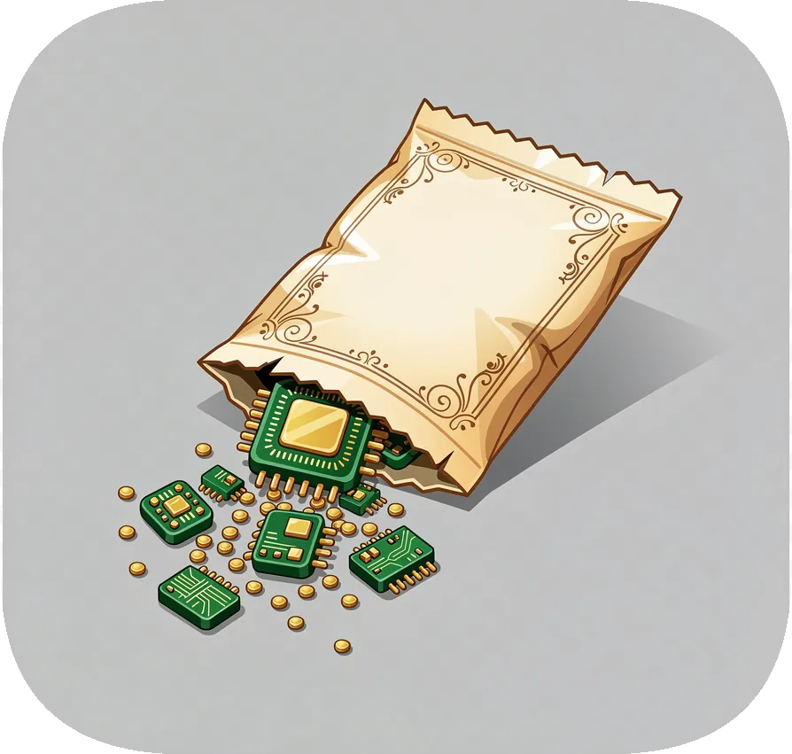

# Vibe Garden



  

> A collection of Claude Code plugins for project management, development workflows, and notifications.
>
> *Repository releases use [CalVer](https://calver.org/) (YYYY.MM). Individual plugins maintain independent semver. Releases are cut quarterly or when significant changes land.*

<br clear="right"/>

---

## Plugins

### Compass Rose - Project Management

**Purpose**: GitHub Projects integration for Claude Code

**Version**: 1.3.0
**Location**: `compass-rose/`

Manage GitHub Projects directly from Claude Code with skills for task tracking, backlog analysis, and priority recommendations.

**Features**:
- Skill-based project management
- Issue tracking and backlog analysis
- Priority recommendations
- Work item lifecycle management

```bash
# Install in Claude Code
/plugin install compass-rose@vibe-garden
```

[Documentation →](compass-rose/README.md)

---

### Lore Development - Project Context

**Purpose**: Build and organize project context for development workflows

**Version**: 0.12.0
**Location**: `lore-development/`

A lightweight plugin for research, brainstorming, specifications, planning, and retrospectives. Helps maintain project knowledge in `.lore/` directories.

**Features**:
- Research and brainstorm tracking
- Specification writing
- Plan mode integration
- Retrospective capture
- Diagram generation (Mermaid)

```bash
# Install in Claude Code
/plugin install lore-development@vibe-garden
```

[Documentation →](lore-development/README.md)

---

### Notify Hook - Notifications

**Purpose**: Desktop and mobile notifications when Claude needs attention

**Version**: 1.0.0
**Location**: `notify-hook/`

Get notified when Claude Code asks a question or completes a long-running task.

**Features**:
- Desktop notifications (Linux/macOS)
- Mobile push notifications via ntfy.sh
- Configurable triggers

```bash
# Install in Claude Code
/plugin install notify-hook@vibe-garden
```

[Documentation →](notify-hook/README.md)

---

### Mind Reader - Active Feedback

**Purpose**: Gentle nudges based on session patterns and sentiment analysis

**Version**: 1.0.0
**Location**: `mind-reader/`

Get proactive feedback when sessions run long, you're working unusual hours, or frustration patterns emerge.

**Features**:
- Temporal detection (session duration, prompt count)
- Unusual hours awareness
- Sentiment analysis (optional, via VADER)
- Configurable thresholds

```bash
# Install in Claude Code
/plugin install mind-reader@vibe-garden
```

[Documentation →](mind-reader/README.md)

---

## Repository Structure

```
vibe-garden/
├── compass-rose/              # GitHub Projects management plugin
│   ├── .claude-plugin/        # Plugin metadata (v1.3.0)
│   ├── skills/                # Skill implementations
│   └── agents/                # Agent definitions
│
├── lore-development/          # Project context and workflow plugin
│   ├── .claude-plugin/        # Plugin metadata (v0.12.0)
│   ├── skills/                # Workflow skills
│   ├── agents/                # Agent definitions
│   └── shared/                # Shared resources
│
├── notify-hook/               # Desktop/mobile notification plugin
│   ├── .claude-plugin/        # Plugin metadata (v1.0.0)
│   ├── hooks/                 # Hook implementations
│   └── scripts/               # Notification scripts
│
└── mind-reader/               # Active feedback plugin
    ├── .claude-plugin/        # Plugin metadata (v1.0.0)
    ├── hooks/                 # UserPromptSubmit hook
    ├── scripts/               # Hook and baseline scripts
    ├── skills/                # Init skill
    └── tests/                 # Unit tests
```

---

## Installation

Install plugins from this repository in Claude Code:

```bash
/plugin install compass-rose@vibe-garden        # Project management
/plugin install lore-development@vibe-garden    # Development workflows
/plugin install notify-hook@vibe-garden         # Notifications
/plugin install mind-reader@vibe-garden         # Active feedback
```

---

## Contributing

Contributions welcome:

1. **Bug Fixes** - All plugins welcome improvements
2. **New Plugins** - Add Claude Code plugins to the ecosystem
3. **Documentation** - Enhance setup guides and tutorials

---

## License

MIT License - see [LICENSE](LICENSE) file for details.

---

## Contact

**Author:** Ronald Roy
**Email:** gsdwig@gmail.com
**Repository:** [github.com/rjroy/vibe-garden](https://github.com/rjroy/vibe-garden)

---

<div align="center">

*Last Updated: 2026-02-01*

</div>
