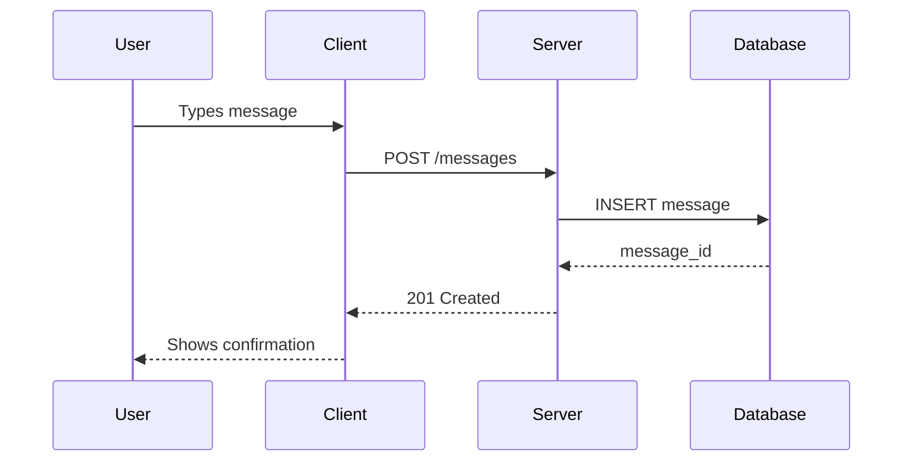
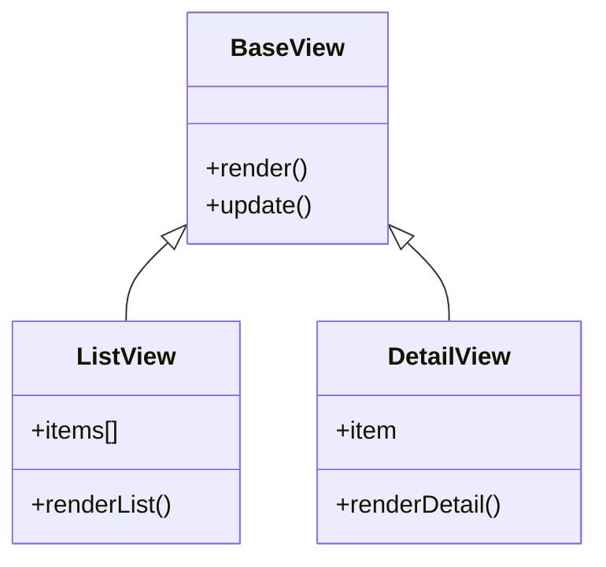
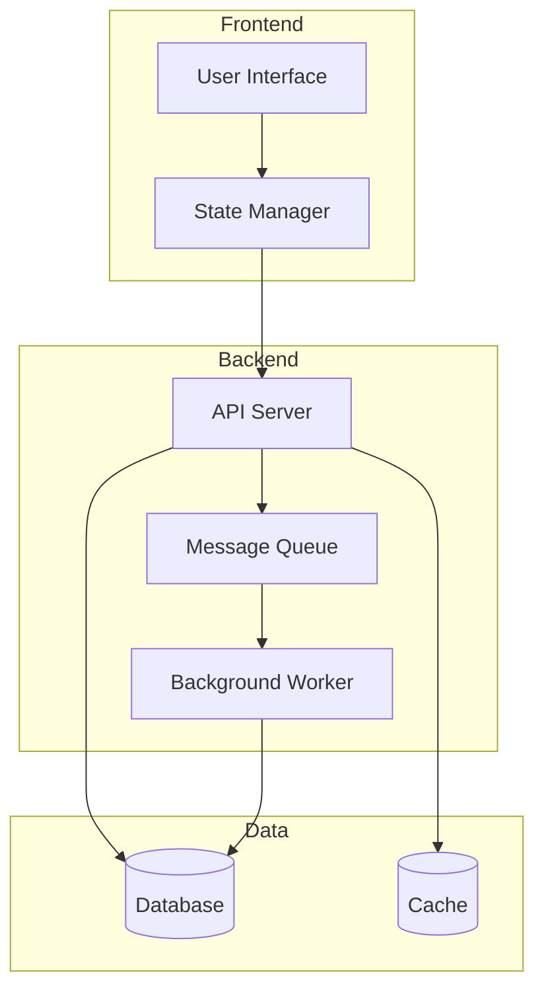
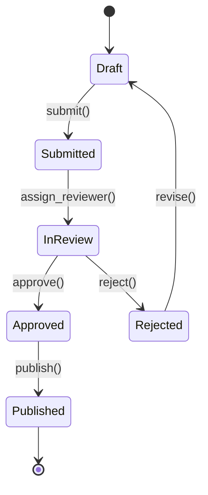
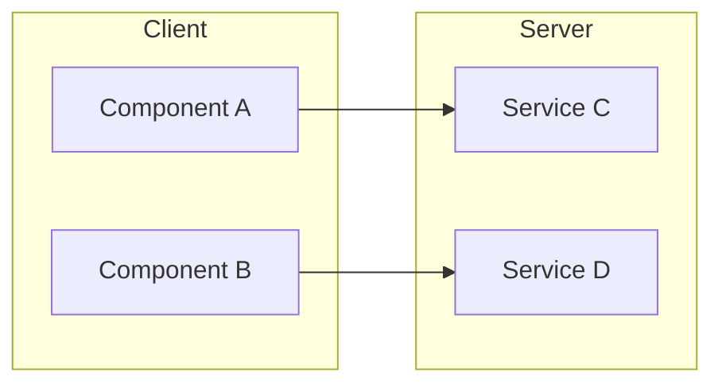
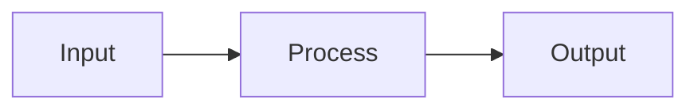
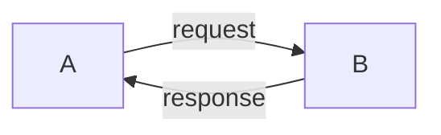
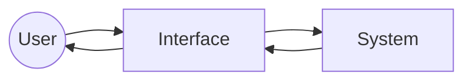

# Mermaid Diagram Patterns

Reference patterns for common diagram types. Load this when creating diagrams.

## Flow: How Data Moves

Use `sequenceDiagram` for interactions between actors:

## Structure: How Things Relate

Use `classDiagram` for inheritance and composition:

## Architecture: How Systems Connect

Use `graph` for component relationships:

## Lifecycle: How States Change

Use `stateDiagram-v2` for state machines:

## Tips

### Keep It Focused

One diagram, one idea. If you're trying to show everything, you're showing nothing.

Bad: "The entire system architecture with all data flows and state transitions"
Good: "How a user message reaches the AI and gets a response"

### Use Subgraphs for Grouping

When showing systems with boundaries:

### Show Direction

Make data flow direction clear. Left-to-right or top-to-bottom for primary flow:

### Label Edges

Don't just show connections - show what flows through them:

### Include the User

System diagrams often forget the human. Include them:

